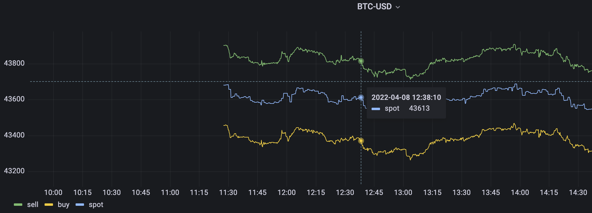

Table of Contents
=================

   * [加密货币](#加密货币)
   * [关于 coinbase 和 TDengine](#关于-coinbase-和-tdengine)
   * [环境准备(Linux)](#环境准备linux)
   * [库 / 表 shema 设计](#库--表-shema-设计)
   * [从 Coinbase 获取数据](#从-coinbase-获取数据)
   * [借助 grafana 面板展示实时交易数据走势](#借助-grafana-面板展示实时交易数据走势)

# 加密货币
* 背景介绍
* 趋势预测
* 借助的工具，分析

# 关于 coinbase 和 TDengine

*  [coinbase](https://www.coinbase.com/)
*  [TDengine](https://www.taosdata.com/)

# 环境准备(Linux)

1.  创建 [coinbase](https://www.coinbase.com/signup) 账号，并且启用 [API 密钥对](https://www.coinbase.com/signin) 。该密钥对会在后面的[官方 coinbase 库](https://developers.coinbase.com/docs/wallet/client-libraries)中使用到，这一步需要确保您能正常访问外网。

2.  确认是否安装 pip，如未安装，执行

```
python -m ensurepip
```

3. 安装[官方 coinbase 库](https://developers.coinbase.com/docs/wallet/client-libraries)：

```
pip install coinbase

# or

easy_install coinbase
```

4.  安装  2.4 之后版本的 TDengine，您可以通过 [apt-get](https://www.taosdata.com/docs/cn/v2.0/getting-started#apt-get) 、[源码](https://www.taosdata.com/docs/cn/v2.0/getting-started#-4) 或 [安装包](https://www.taosdata.com/docs/cn/v2.0/getting-started#-2) 快速安装。

安装完成之后[启动](https://www.taosdata.com/docs/cn/v2.0/getting-started#-5) taosd 和 taosadapter (对应 6041 端口，后续连接时会使用到)

```
systemctl start taosd
systemctl start taosadapter
```
检查服务是否正常工作：

```
systemctl status taosd
systemctl status taosadapter
```

5.  安装 [TDengine python 连接器](https://www.taosdata.com/docs/cn/v2.0/connector#python)


# 库 / 表 shema 设计

* database 创建，这里我们创建一个名为 `cryptocurrency` 的数据库

```
CREATE DATABASE cryptocurrency;
```

* 超级表设计

我们使用三个列字段作为 TAG: `FromCCY`（货币源）、`ToCCY`（目标货币）、`Platform`（交易平台）
其它四个字段为：`ts`（时间戳）、`spot`（当前价格）、`sell` （售价）、`buy`（买入价）

```
CREATE STABLE coinbase(ts timestamp, spot float, sell float, buy float) tags(FromCCY binary(10), ToCCY binary(10), Platform binary(10));
```

* 子表构建方式

我们在 Insert 数据时直接[基于超级表创建](https://www.taosdata.com/docs/cn/v2.0/taos-sql#-3)：
```
INSERT INTO cryptocurrency.BTC_USD_PLATFORM USING coinbase TAGS('BTC', 'USD', 'CB') VALUES ('2022-04-07T10:48:50Z', 1.100000, 1.100000, 1.100000);
```

# 从 Coinbase 获取数据

[官方文档示例代码](https://developers.coinbase.com/docs/wallet/guides/price-data)给我们展示了如何获取并打印出实时交易的价格数据。我们基于 TDengine 做了以下扩展：


* 从 coinbase 获取当前时间戳（ts）、当前价格（spot）、买入价格（buy）、售价（sell）。
* 通过 TDengine python 连接器将 当前时间戳（ts）、当前价格（spot）、买入价格（buy）、售价（sell）数据写入 TDengine。
* 每秒循环一次。

```
from coinbase.wallet.client import Client
from time import sleep
import taos

# Set coinbase params
currency_code = 'USD'  # can also use EUR, CAD, etc.
FromCCY = "BTC"
ToCCY = "USD"
Platform = "PLATFORM"

# Get TDengine connection
DB = "cryptocurrency"
HOST = "your-host"
USER = 'root'
PASS = 'taosdata'

# SET coinbase api key-secret and api version
KEY = "your-api-key"
KEY_SECRET = "your-key-secret"
API_VERSION = "2022-03-28"

try:
    conn = taos.connect(host=HOST, user=USER, password=PASS, database=DB)
except Exception as e:
    print(e)

if __name__ == '__main__':
    try:
        while 1==1:
            # Make the request 
            client = Client(KEY, KEY_SECRET, api_version=API_VERSION)

            time = client.get_time(api_version=API_VERSION).iso
            spot_price = float(client.get_spot_price(currency=currency_code).amount)
            buy_price = float(client.get_buy_price(currency=currency_code).amount)
            sell_price = float(client.get_sell_price(currency=currency_code).amount)

            sql = "INSERT INTO %s.%s_%s_%s USING coinbase TAGS('%s', '%s', '%s') VALUES ('%s', %f, %f, %f)" % (DB,
                                                                                      FromCCY,
                                                                                      ToCCY,
                                                                                      Platform,
                                                                                      FromCCY,
                                                                                      ToCCY,
                                                                                      Platform,
                                                                                      time,
                                                                                      spot_price,
                                                                                      buy_price,
                                                                                      sell_price)

            print(sql)
            conn.cursor().execute(sql)

            # loop, sleep 2 seconds 
            sleep(2)

    except Exception as e:
        print(e)
```

* 运行脚本：

```
$python coinbase-price.py
INSERT INTO cryptocurrency.BTC_USD_PLATFORM USING coinbase TAGS('BTC', 'USD', 'PLATFORM') VALUES ('2022-04-08T02:42:46Z', 43643.710000, 43882.020000, 43438.410000)
INSERT INTO cryptocurrency.BTC_USD_PLATFORM USING coinbase TAGS('BTC', 'USD', 'PLATFORM') VALUES ('2022-04-08T02:42:49Z', 43671.060000, 43882.020000, 43438.410000)
INSERT INTO cryptocurrency.BTC_USD_PLATFORM USING coinbase TAGS('BTC', 'USD', 'PLATFORM') VALUES ('2022-04-08T02:42:52Z', 43671.060000, 43882.020000, 43438.410000)
...
...
```

使用 [命令行程序 TAOS](https://www.taosdata.com/docs/cn/v2.0/getting-started#console) 连接到 TDengine，执行 select 查询：

```
taos> select * from cryptocurrency.btc_usd_platform;
           ts            |         spot         |         sell         |         buy          |
===============================================================================================
2022-04-08 10:30:18.000 |          43614.17188 |          43842.78125 |          43388.55078 |
2022-04-08 10:30:21.000 |          43610.01953 |          43842.78125 |          43388.55078 |
2022-04-08 10:30:23.000 |          43610.01953 |          43842.78125 |          43388.55078 |
2022-04-08 10:31:32.000 |          43610.53125 |          43816.14062 |          43372.69141 |
...
...
```

#  借助 grafana 面板展示实时交易数据走势

* 安装grafana， 这里注意需要配置 TDengine 到数据源，详见[安装、配置 grafana 说明](https://www.taosdata.com/docs/cn/v2.0/connections#grafana) 

* [创建和使用 dashboard](https://www.taosdata.com/docs/cn/v2.0/connections#dashboard) 
* Input SQL 设计，参见上一步  [创建和使用 dashboard](https://www.taosdata.com/docs/cn/v2.0/connections#dashboard)  说明部分，这里我们给出一个示例，具体参数可替换为TDengine 插件的内置变量:

```
select avg(sell) as sell, avg(buy) as buy, avg(spot) from cryptocurrency.coinbase where ts > '2022-04-02 14:10:00' and ts < '2022-4-31 18:40:00' and fromCCY='BTC' and toCCY='USD' and platform='PLATFORM' interval(10s);
```

导入 SQL，在 dashboard 展示实时价格数和买卖价格数据：


