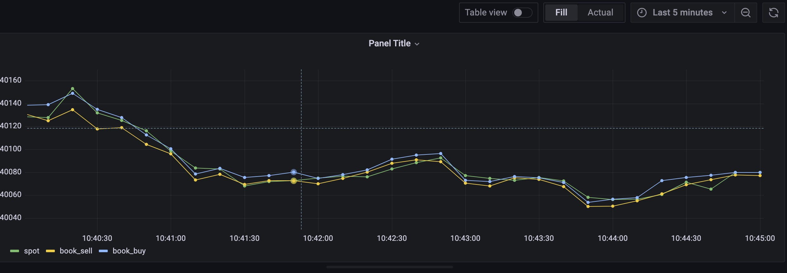

Table of Contents
=================

   * [Prepare](#prepare)
   * [Prepare Database and Table](#prepare-database-and-table)
   * [Fetch data from Binance](#fetch-data-from-binance)
   * [Building a dashboard based on Grafana](#building-a-dashboard-based-on-grafana)

[Binance official site](https://www.binance.com/en)

All the operations are performed under the Linux system.

# Prepare

1. Install pip.

```
python -m ensurepip
```

2. Install Python lib `requests`.

```
pip install requests

# or

easy_install requests
```

3. Install TDengine (version >= 2.4) by [apt-get](https://tdengine.com/docs/en/v2.0/getting-started#install-tdengine-by-apt-g), [Source code](https://tdengine.com/docs/en/v2.0/getting-started#install-from-source) or [Package](https://tdengine.com/docs/en/v2.0/getting-started#install-from-package).

After install success, [start taosd and taosadapter](https://tdengine.com/docs/en/v2.0/getting-started#quick-launch).

```
systemctl start taosd
systemctl start taosadapter
```

Check service status.

```
systemctl status taosd
systemctl status taosadapter
```

4. Install [TDengine Python Connector](https://tdengine.com/docs/en/v2.0/connector#python).

# Prepare Database and Table

* [Create a database](https://tdengine.com/docs/en/v2.0/taos-sql#management), here we create a database named `cryptocurrency`:

```
CREATE DATABASE cryptocurrency;
```

* [Create super table](https://tdengine.com/docs/en/v2.0/taos-sql#stable-management)

Set two column fields as TAGS:
`FromCCYto`: Convert the currency `From` to the corresponding value of the target currency `To`.
`Platform`: Trade platform like `coinbase`, `binance`, etc.

get the best price/qty on the order book for a token symbol or symbols.
The fields of table column：
`ts`: timestamp
`spot_price`: live price
`bid_price`: the best bid(sell) price on the order book
`bid_qty`: bid qty
`ask_price`: the best ask(buy) price on the order book
`ask_qty`: ask qty

```
CREATE STABLE binance(ts timestamp, spot_price float, bid_price float, bid_qty float, ask_price float, ask_qty float) tags(FromCCYto binary(20), Platform binary(10));
```

* Create sub table

Insert 数据时直接 [Auto create base on super table](https://tdengine.com/docs/en/v2.0/taos-sql#data-writing):

```
INSERT INTO cryptocurrency.binance_BTCUSD USING binance TAGS('BTCUSD', 'binance') VALUES (1649831015777, 40099.180000, 40101.600000, 0.001813, 40110.260000, 0.004553)
```

# Fetch data from Binance

[Binance API](https://docs.binance.us/#introduction) provides the method on how to access to [market trade and price data](https://docs.binance.us/?python#get-live-ticker-price). Next we'll make requests to get price data from provided endpoint and write to TDengine.

```
import requests
from time import sleep
import taos

# Currently we support 5 cryptocurrency to USD
PLATFORM = "binance"
SYMBOLS_SIZE = 5
SYMBOLS = '["BTCUSD","ETHUSD","LTCBTC","BCHUSD","DOGEUSD"]'
PRICE_URL = 'https://api.binance.us/api/v3/ticker/price?symbols='
BEST_ORDER_BOOK_PRICE_URL = 'https://api.binance.us/api/v3/ticker/bookTicker?symbols='

# TDengine connection args
DB = "cryptocurrency"
HOST = "127.0.0.1"
USER = "root"
PASS = "taosdata"

# Get TDengine connection
def get_conn():
        return taos.connect(host=HOST, user=USER, password=PASS, database=DB)

if __name__ == '__main__':
    price_url = PRICE_URL + SYMBOLS
    best_order_book_price_url = BEST_ORDER_BOOK_PRICE_URL + SYMBOLS
    conn = get_conn()

    try:
        while 1 == 1:

            # Get binance server time: {"serverTime":1649775807821}
            respTime = requests.get('https://api.binance.us/api/v3/time')
            serverTime = respTime.json()['serverTime']

            # resp: [{'symbol': 'BTCUSD', 'price': '40130.3000'}, {'symbol': 'ETHUSD', 'price': '3015.1800'},...]
            ticker_price = requests.get(price_url).json()
            # resp: [{'symbol': 'BTCUSD', 'bidPrice': '40120.5700', 'bidQty': '0.20000000', 'askPrice': '40125.2600', 'askQty': '0.01246300'},...]
            best_order_book_price = requests.get(best_order_book_price_url).json()

            for idx in range (SYMBOLS_SIZE):
                sym = ticker_price[idx]['symbol']
                table = DB + "." + PLATFORM + "_" + sym
                sql = "INSERT INTO %s USING binance TAGS('%s', '%s') VALUES (%s, %f, %f, %f, %f, %f)" % (table,
                                                                            sym,
                                                                            PLATFORM,
                                                                            serverTime,
                                                                            float(ticker_price[idx]['price']),
                                                                            float(best_order_book_price[idx]['bidPrice']),
                                                                            float(best_order_book_price[idx]['bidQty']),
                                                                            float(best_order_book_price[idx]['askPrice']),
                                                                            float(best_order_book_price[idx]['askQty']))
                conn.cursor().execute(sql)

            sleep(1)
    except Exception as e:
        print(e)
```

* Run Python scripts:

```
$nohup python get-price.py &
```

Using [TDengine Shell Cmd Line](https://tdengine.com/docs/en/v2.0/getting-started#tdengine-shell-command-li) connect to TDengine and make a query:

```
taos> use cryptocurrency;
Database changed.

taos> show tables;
           table_name           |      created_time       | columns |          stable_name           |          uid          |     tid     |    vgId     |
==========================================================================================================================================================
 binance_dogeusd                | 2022-04-12 20:07:15.600 |       6 | binance                        |      1407374984234726 |           6 |           5 |
 binance_btcusd                 | 2022-04-12 20:07:15.586 |       6 | binance                        |      1407374917124792 |           2 |           5 |
 binance_ethusd                 | 2022-04-12 20:07:15.591 |       6 | binance                        |      1407374933902310 |           3 |           5 |
 binance_bchusd                 | 2022-04-12 20:07:15.594 |       6 | binance                        |      1407374950679782 |           4 |           5 |
 binance_ltcbtc                 | 2022-04-12 20:07:15.597 |       6 | binance                        |      1407374967457254 |           5 |           5 |
Query OK, 5 row(s) in set (0.002730s)
```

Make a select to query binance_btcusd:

```
taos> select * from binance_btcusd limit 10;
           ts            |      spot_price      |      bid_price       |       bid_qty        |      ask_price       |       ask_qty        |
=============================================================================================================================================
 2022-04-12 20:07:14.866 |          40386.35938 |          40401.87891 |              0.00151 |          40412.17188 |              0.00176 |
 2022-04-12 20:11:08.926 |          40405.00000 |          40404.32812 |              0.00189 |          40406.67188 |              0.00192 |
 2022-04-12 20:11:15.744 |          40403.55859 |          40397.35156 |              0.01485 |          40407.42969 |              0.20000 |
...
...
Query OK, 10 row(s) in set (0.002806s)
```

# Building a dashboard based on Grafana

* Install Grafana and [Config Grafana wiht TDengine plugin](https://tdengine.com/docs/en/v2.0/connections#grafana)

* [Create Dashboard](https://tdengine.com/docs/en/v2.0/connections#create-dashboard)

* Input SQL:

```
select avg(spot_price) as spot, avg(bid_price) as book_sell, avg(ask_price) as book_buy from cryptocurrency.binance where ts >= $from and ts < $to interval($interval)；
```

Ref from [Create Dashboard](https://tdengine.com/docs/en/v2.0/connections#create-dashboard).

> INPUT SQL: Enter the statement to query (the result set of the SQL statement should be two columns and multiple rows), for example: select avg(mem_system) from log.dn where ts >= $from and ts < $to interval($interval) , where from, to and interval are built-in variables of the TDengine plug-in, representing the query range and time interval obtained from the Grafana plug-in panel. In addition to built-in variables, it is also supported to use custom template variables.


Import SQL and make a Dashboard to show the `BTCUSD` price data:



Of course, it can display different types of cryptocurrencies converted to US dollars on the same panel in a custom way:


