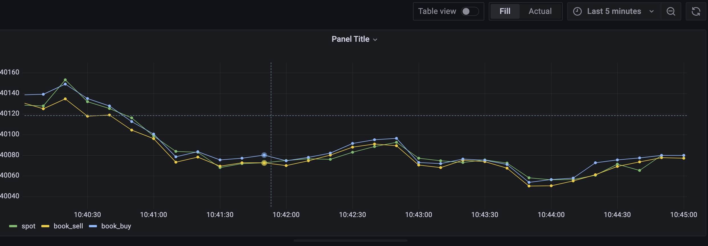
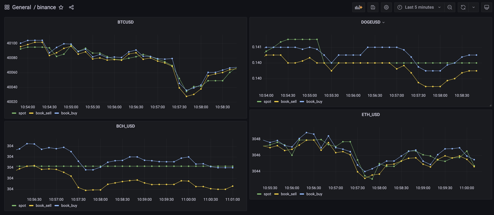

目录
=================

   * [环境准备](#环境准备)
   * [数据库、表设计](#数据库表设计)
   * [访问 binance 数据](#访问-binance-数据)
   * [借助 grafana 面板展示实时价格数据走势](#借助-grafana-面板展示实时价格数据走势)
   * [未来](#未来)

[Binance 中文官网](https://www.binancezh.top/zh-CN)

# 环境准备

以下所有的操作均默认在 Linux 系统下进行。

1. 确认是否安装 pip，如未安装，执行

```
python -m ensurepip
```

2. 安装 python `requests` 库

```
pip install requests

# or

easy_install requests
```

3. 安装 2.4 之后版本的 TDengine，您可以通过 [apt-get](https://www.taosdata.com/docs/cn/v2.0/getting-started#apt-get) 、[源码](https://www.taosdata.com/docs/cn/v2.0/getting-started#-4) 或 [安装包](https://www.taosdata.com/docs/cn/v2.0/getting-started#-2) 快速安装。

安装完成之后 [启动 taosd 和 taosadapter ](https://www.taosdata.com/docs/cn/v2.0/getting-started#-5)。

```
systemctl start taosd
systemctl start taosadapter
```

检查服务是否正常工作：

```
systemctl status taosd
systemctl status taosadapter
```

4. 安装 [TDengine python 连接器](https://www.taosdata.com/docs/cn/v2.0/connector#python)

# 数据库、表设计

* [创建 database](https://www.taosdata.com/docs/cn/v2.0/taos-sql#management)，这里我们创建一个名为 `cryptocurrency` 的数据库

```
CREATE DATABASE cryptocurrency;
```

* [创建超级表](https://www.taosdata.com/docs/cn/v2.0/taos-sql#super-table)

我们使用两个列字段作为 TAG: `FromCCYto`、`Platform`（交易平台）
其它四个字段为：`ts`（时间戳）、`spot_price`（当前价格）、`bid_price` （当前最低卖单）、`bid_qty`（挂单数）、`ask_price`（当前最高买单）、`ask_qty`（挂单数）

```
CREATE STABLE binance(ts timestamp, spot_price float, bid_price float, bid_qty float, ask_price float, ask_qty float) tags(FromCCYto binary(20), Platform binary(10));
```

* 子表构建方式

我们在 Insert 数据时直接 [基于超级表自动创建](https://www.taosdata.com/docs/cn/v2.0/taos-sql#-3)：

```
INSERT INTO cryptocurrency.binance_BTCUSD USING binance TAGS('BTCUSD', 'binance') VALUES (1649831015777, 40099.180000, 40101.600000, 0.001813, 40110.260000, 0.004553)
```

# 访问 binance 数据

[官方 API 文档](https://docs.binance.us/#introduction) 详细阐述了如何访问相关数据，以下将通过访问 url 获取 [最新价格和最优挂单数据](https://docs.binance.us/?python#get-live-ticker-price) 并写入到 TDengine：

```
import requests
from time import sleep
import taos

# Currently we support 5 cryptocurrency to USD
PLATFORM = "binance"
SYMBOLS_SIZE = 5 
SYMBOLS = '["BTCUSD","ETHUSD","LTCBTC","BCHUSD","DOGEUSD"]'
PRICE_URL = 'https://api.binance.us/api/v3/ticker/price?symbols='
BEST_ORDER_BOOK_PRICE_URL = 'https://api.binance.us/api/v3/ticker/bookTicker?symbols='

# TDengine connection args
DB = "cryptocurrency"
HOST = "127.0.0.1"
USER = "root"
PASS = "taosdata"

# Get TDengine connection
def get_conn():
        return taos.connect(host=HOST, user=USER, password=PASS, database=DB)
    
if __name__ == '__main__':
    price_url = PRICE_URL + SYMBOLS
    best_order_book_price_url = BEST_ORDER_BOOK_PRICE_URL + SYMBOLS
    conn = get_conn()

    try:
        while 1 == 1:

            # Get binance server time: {"serverTime":1649775807821}
            respTime = requests.get('https://api.binance.us/api/v3/time')
            serverTime = respTime.json()['serverTime']
   
            # resp: [{'symbol': 'BTCUSD', 'price': '40130.3000'}, {'symbol': 'ETHUSD', 'price': '3015.1800'},...]
            ticker_price = requests.get(price_url).json()
            # resp: [{'symbol': 'BTCUSD', 'bidPrice': '40120.5700', 'bidQty': '0.20000000', 'askPrice': '40125.2600', 'askQty': '0.01246300'},...]
            best_order_book_price = requests.get(best_order_book_price_url).json()

            for idx in range (SYMBOLS_SIZE):
                sym = ticker_price[idx]['symbol']
                table = DB + "." + PLATFORM + "_" + sym 
                sql = "INSERT INTO %s USING binance TAGS('%s', '%s') VALUES (%s, %f, %f, %f, %f, %f)" % (table,
                                                                            sym,
                                                                            PLATFORM,
                                                                            serverTime,
                                                                            float(ticker_price[idx]['price']),
                                                                            float(best_order_book_price[idx]['bidPrice']),
                                                                            float(best_order_book_price[idx]['bidQty']),
                                                                            float(best_order_book_price[idx]['askPrice']),
                                                                            float(best_order_book_price[idx]['askQty']))
                conn.cursor().execute(sql)

            sleep(1)
    except Exception as e:
        print(e)  
```

* 运行脚本：

```
$nohup python get-price.py &
```

使用 [命令行程序 TAOS](https://www.taosdata.com/docs/cn/v2.0/getting-started#console) 连接到 TDengine，查询创建的表：

```
taos> use cryptocurrency;
Database changed.

taos> show tables;
           table_name           |      created_time       | columns |          stable_name           |          uid          |     tid     |    vgId     |
==========================================================================================================================================================
 binance_dogeusd                | 2022-04-12 20:07:15.600 |       6 | binance                        |      1407374984234726 |           6 |           5 |
 binance_btcusd                 | 2022-04-12 20:07:15.586 |       6 | binance                        |      1407374917124792 |           2 |           5 |
 binance_ethusd                 | 2022-04-12 20:07:15.591 |       6 | binance                        |      1407374933902310 |           3 |           5 |
 binance_bchusd                 | 2022-04-12 20:07:15.594 |       6 | binance                        |      1407374950679782 |           4 |           5 |
 binance_ltcbtc                 | 2022-04-12 20:07:15.597 |       6 | binance                        |      1407374967457254 |           5 |           5 |
Query OK, 5 row(s) in set (0.002730s)
```

查看表 binance_btcusd 数据：

```
taos> select * from binance_btcusd limit 10;
           ts            |      spot_price      |      bid_price       |       bid_qty        |      ask_price       |       ask_qty        |
=============================================================================================================================================
 2022-04-12 20:07:14.866 |          40386.35938 |          40401.87891 |              0.00151 |          40412.17188 |              0.00176 |
 2022-04-12 20:11:08.926 |          40405.00000 |          40404.32812 |              0.00189 |          40406.67188 |              0.00192 |
 2022-04-12 20:11:15.744 |          40403.55859 |          40397.35156 |              0.01485 |          40407.42969 |              0.20000 |
...
...
Query OK, 10 row(s) in set (0.002806s)
```

#  借助 grafana 面板展示实时价格数据走势

* 安装 Grafana， 这里注意需要配置 TDengine 的数据源，详见 [安装、配置 Grafana 说明](https://www.taosdata.com/docs/cn/v2.0/connections#grafana) 

* [创建和使用 Dashboard](https://www.taosdata.com/docs/cn/v2.0/connections#dashboard) 

* Input SQL 设计，参见上一步  [创建和使用 Dashboard](https://www.taosdata.com/docs/cn/v2.0/connections#dashboard)  说明部分，这里我们给出一个示例，具体参数可替换为 TDengine 插件的内置变量:

```
select avg(spot_price) as spot, avg(bid_price) as book_sell, avg(ask_price) as book_buy from cryptocurrency.binance where ts >= $from and ts < $to interval($interval)；
```

from、to 和 interval 为 TDengine 插件的内置变量，表示从 Grafana 插件面板获取的查询范围和时间间隔。

导入 SQL，在 Dashboard 展示实时价格数和最高买单和最低卖单价格数据：



当然也可以通过自定义方式，将不通类型的加密货币转换美元的放到同一个面板展示：



# 未来

基于 [TDengine](https://www.taosdata.com) 和 Grafana，我们可以在加密货币领域做很多事情。比如从各个加密货币平台访问实时数据写入到 TDengine，观察曲线波动情况，甚至可以借助一些工具来做数据分析和趋势预测。
